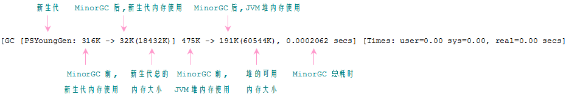
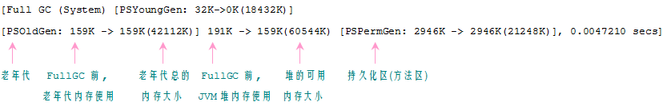

堆内存
Java 中的堆是 JVM 所管理的最大的一块内存空间，主要用于存放各种类的实例对象。
在 Java 中，堆被划分成两个不同的区域：新生代 ( Young )、老年代 ( Old )。新生代 ( Young ) 又被划分为三个区域：Eden、From Survivor、To Survivor。
这样划分的目的是为了使 JVM 能够更好的管理堆内存中的对象，包括内存的分配以及回收。
堆的内存模型大致为：


从图中可以看出： 堆大小 = 新生代 + 老年代。其中，堆的大小可以通过参数 –Xms、-Xmx 来指定。
本人使用的是 JDK1.6，以下涉及的 JVM 默认值均以该版本为准。
默认的，新生代 ( Young ) 与老年代 ( Old ) 的比例的值为 1:2 ( 该值可以通过参数 –XX:NewRatio 来指定 )，即：新生代 ( Young ) = 1/3 的堆空间大小。
老年代 ( Old ) = 2/3 的堆空间大小。其中，新生代 ( Young ) 被细分为 Eden 和 两个 Survivor 区域，这两个 Survivor 区域分别被命名为 from 和 to，以示区分。
默认的，Edem : from : to = 8 : 1 : 1 ( 可以通过参数 –XX:SurvivorRatio 来设定 )，即： Eden = 8/10 的新生代空间大小，from = to = 1/10 的新生代空间大小。
JVM 每次只会使用 Eden 和其中的一块 Survivor 区域来为对象服务，所以无论什么时候，总是有一块 Survivor 区域是空闲着的。
因此，新生代实际可用的内存空间为 9/10 ( 即90% )的新生代空间。

###GC 堆
Java 中的堆也是 GC 收集垃圾的主要区域。GC 分为两种：Minor GC、Full GC ( 或称为 Major GC )。
Minor GC 是发生在新生代中的垃圾收集动作，所采用的是复制算法。
新生代几乎是所有 Java 对象出生的地方，即 Java 对象申请的内存以及存放都是在这个地方。Java 中的大部分对象通常不需长久存活，具有朝生夕灭的性质。
当一个对象被判定为 "死亡" 的时候，GC 就有责任来回收掉这部分对象的内存空间。新生代是 GC 收集垃圾的频繁区域。
当对象在 Eden ( 包括一个 Survivor 区域，这里假设是 from 区域 ) 出生后，在经过一次 Minor GC 后，如果对象还存活，并且能够被另外一块 Survivor 区域所容纳
( 上面已经假设为 from 区域，这里应为 to 区域，即 to 区域有足够的内存空间来存储 Eden 和 from 区域中存活的对象 )，则使用复制算法将这些仍然还存活的对象复制到另外一块 Survivor 区域 ( 即 to 区域 ) 中，然后清理所使用过的 Eden 以及 Survivor 区域 ( 即 from 区域 )，并且将这些对象的年龄设置为1，以后对象在 Survivor 区每熬过一次 Minor GC，就将对象的年龄 + 1，当对象的年龄达到某个值时 ( 默认是 15 岁，可以通过参数 -XX:MaxTenuringThreshold 来设定 )，这些对象就会成为老年代。
但这也不是一定的，对于一些较大的对象 ( 即需要分配一块较大的连续内存空间 ) 则是直接进入到老年代。
Full GC 是发生在老年代的垃圾收集动作，所采用的是标记-清除算法。
现实的生活中，老年代的人通常会比新生代的人 "早死"。堆内存中的老年代(Old)不同于这个，老年代里面的对象几乎个个都是在 Survivor 区域中熬过来的，它们是不会那么容易就 "死掉" 了的。因此，Full GC 发生的次数不会有 Minor GC 那么频繁，并且做一次 Full GC 要比进行一次 Minor GC 的时间更长。
另外，标记-清除算法收集垃圾的时候会产生许多的内存碎片 ( 即不连续的内存空间 )，此后需要为较大的对象分配内存空间时，若无法找到足够的连续的内存空间，就会提前触发一次 GC 的收集动作。

GC 日志
```
public static void main(String[] args) {
    Object obj = new Object();
    System.gc();
    System.out.println();
    obj = new Object();
    obj = new Object();
    System.gc();
    System.out.println();
}
```

设置 JVM 参数为 -XX:+PrintGCDetails，使得控制台能够显示 GC 相关的日志信息，执行上面代码，下面是其中一次执行的结果。





Full GC 信息与 Minor GC 的信息是相似的，这里就不一个一个的画出来了。
从 Full GC 信息可知，新生代可用的内存大小约为 18M，则新生代实际分配得到的内存空间约为 20M(为什么是 20M? 请继续看下面...)。老年代分得的内存大小约为 42M，堆的可用内存的大小约为 60M。可以计算出： 18432K ( 新生代可用空间 ) + 42112K ( 老年代空间 ) = 60544K ( 堆的可用空间 )
新生代约占堆大小的 1/3，老年代约占堆大小的 2/3。也可以看出，GC 对新生代的回收比较乐观，而对老年代以及方法区的回收并不明显或者说不及新生代。
并且在这里 Full GC 耗时是 Minor GC 的 22.89 倍。
JVM 参数选项
jvm 可配置的参数选项可以参考 Oracle 官方网站给出的相关信息：http://www.oracle.com/technetwork/java/javase/tech/vmoptions-jsp-140102.html
下面只列举其中的几个常用和容易掌握的配置选项：

```xml
 -Xms	 初始堆大小。如：-Xms256m
 -Xmx	 最大堆大小。如：-Xmx512m
 -Xmn	 新生代大小。通常为 Xmx 的 1/3 或 1/4。新生代 = Eden + 2 个 Survivor 空间。实际可用空间为 = Eden + 1 个 Survivor，即 90%  
 -Xss	 JDK1.5+ 每个线程堆栈大小为 1M，一般来说如果栈不是很深的话， 1M 是绝对够用了的。
 -XX:NewRatio	 新生代与老年代的比例，如 –XX:NewRatio=2，则新生代占整个堆空间的1/3，老年代占2/3
 -XX:SurvivorRatio	 新生代中 Eden 与 Survivor 的比值。默认值为 8。即 Eden 占新生代空间的 8/10，另外两个 Survivor 各占 1/10  
 -XX:PermSize	 永久代(方法区)的初始大小
 -XX:MaxPermSize	 永久代(方法区)的最大值
 -XX:+PrintGCDetails	 打印 GC 信息
 -XX:+HeapDumpOnOutOfMemoryError	 让虚拟机在发生内存溢出时 Dump 出当前的内存堆转储快照，以便分析用
```

```
 1 /**
 2  -Xms60m
 3  -Xmx60m
 4  -Xmn20m
 5  -XX:NewRatio=2 ( 若 Xms = Xmx, 并且设定了 Xmn, 那么该项配置就不需要配置了 )
 6  -XX:SurvivorRatio=8
 7  -XX:PermSize=30m
 8  -XX:MaxPermSize=30m
 9  -XX:+PrintGCDetails
10  */
11 public static void main(String[] args) {
12     new Test().doTest();
13 }
14 
15 public void doTest(){
16     Integer M = new Integer(1024 * 1024 * 1);  //单位, 兆(M)
17     byte[] bytes = new byte[1 * M]; //申请 1M 大小的内存空间
18     bytes = null;  //断开引用链
19     System.gc();   //通知 GC 收集垃圾
20     System.out.println();
21     bytes = new byte[1 * M];  //重新申请 1M 大小的内存空间
22     bytes = new byte[1 * M];  //再次申请 1M 大小的内存空间
23     System.gc();
24     System.out.println();
25 }
```

按上面代码中注释的信息设定 jvm 相关的参数项，并执行程序，下面是一次执行完成控制台打印的结果：

```
[ GC [ PSYoungGen:  1351K -> 288K (18432K) ]  1351K -> 288K (59392K), 0.0012389 secs ]  [ Times: user=0.00 sys=0.00, real=0.00 secs ] 
[ Full GC (System)  [ PSYoungGen:  288K -> 0K (18432K) ]  [ PSOldGen:  0K -> 160K (40960K) ]  288K -> 160K (59392K)  [ PSPermGen:  2942K -> 2942K (30720K) ],  0.0057649 secs ] [ Times:  user=0.00  sys=0.00,  real=0.01 secs ] 

[ GC [ PSYoungGen:  2703K -> 1056K (18432K) ]  2863K -> 1216K(59392K),  0.0008206 secs ]  [ Times: user=0.00 sys=0.00, real=0.00 secs ] 
[ Full GC (System)  [ PSYoungGen:  1056K -> 0K (18432K) ]  [ PSOldGen:  160K -> 1184K (40960K) ]  1216K -> 1184K (59392K)  [ PSPermGen:  2951K -> 2951K (30720K) ], 0.0052445 secs ]  [ Times: user=0.02 sys=0.00, real=0.01 secs ] 

Heap
 PSYoungGen      total 18432K, used 327K [0x00000000fec00000, 0x0000000100000000, 0x0000000100000000)
  eden space 16384K, 2% used [0x00000000fec00000,0x00000000fec51f58,0x00000000ffc00000)
  from space 2048K, 0% used [0x00000000ffe00000,0x00000000ffe00000,0x0000000100000000)
  to   space 2048K, 0% used [0x00000000ffc00000,0x00000000ffc00000,0x00000000ffe00000)
 PSOldGen        total 40960K, used 1184K [0x00000000fc400000, 0x00000000fec00000, 0x00000000fec00000)
  object space 40960K, 2% used [0x00000000fc400000,0x00000000fc5281f8,0x00000000fec00000)
 PSPermGen       total 30720K, used 2959K [0x00000000fa600000, 0x00000000fc400000, 0x00000000fc400000)
  object space 30720K, 9% used [0x00000000fa600000,0x00000000fa8e3ce0,0x00000000fc400000)
```

从打印结果可以看出，堆中新生代的内存空间为 18432K ( 约 18M )，eden 的内存空间为 16384K ( 约 16M)，from / to survivor 的内存空间为 2048K ( 约 2M)。
这里所配置的 Xmn 为 20M，也就是指定了新生代的内存空间为 20M，可是从打印的堆信息来看，新生代怎么就只有 18M 呢? 另外的 2M 哪里去了? 
别急，是这样的。新生代 = eden + from + to = 16 + 2 + 2 = 20M，可见新生代的内存空间确实是按 Xmn 参数分配得到的。
而且这里指定了 SurvivorRatio = 8，因此，eden = 8/10 的新生代空间 = 8/10 * 20 = 16M。from = to = 1/10 的新生代空间 = 1/10 * 20 = 2M。
堆信息中新生代的 total 18432K 是这样来的： eden + 1 个 survivor = 16384K + 2048K = 18432K，即约为 18M。
因为 jvm 每次只是用新生代中的 eden 和 一个 survivor，因此新生代实际的可用内存空间大小为所指定的 90%。
因此可以知道，这里新生代的内存空间指的是新生代可用的总的内存空间，而不是指整个新生代的空间大小。
另外，可以看出老年代的内存空间为 40960K ( 约 40M )，堆大小 = 新生代 + 老年代。因此在这里，老年代 = 堆大小 - 新生代 = 60 - 20 = 40M。
最后，这里还指定了 PermSize = 30m，PermGen 即永久代 ( 方法区 )，它还有一个名字，叫非堆，主要用来存储由 jvm 加载的类文件信息、常量、静态变量等。

打个盹，回到 doTest() 方法中，可以看到代码在第 17、21、22 这三行中分别申请了一块 1M 大小的内存空间，并在 19 和 23 这两行中分别显式的调用了 System.gc()。从控制台打印的信息来看，每次调 System.gc()，是先进行 Minor GC，然后再进行 Full GC。
第 19 行触发的 Minor GC 收集分析：
从信息 PSYoungGen :  1351K -> 288K，可以知道，在第 17 行为 bytes 分配的内存空间已经被回收完成。
引起 GC 回收这 1M 内存空间的因素是第 18 行的 bytes = null;   bytes 为 null 表明之前申请的那 1M 大小的内存空间现在已经没有任何引用变量在使用它了，
并且在内存中它处于一种不可到达状态 ( 即没有任何引用链与 GC Roots 相连 )。那么，当 Minor GC 发生的时候，GC 就会来回收掉这部分的内存空间。
第 19 行触发的 Full GC 收集分析：
在 Minor GC 的时候，信息显示 PSYoungGen :  1351K -> 288K，再看看 Full GC 中显示的 PSYoungGen :  288K -> 0K，可以看出，Full GC 后，新生代的内存使用变成
0K 了 ( 0K，零 K，有没有人看成是英文的 OK 的 ? 好吧。我承认我第一次看的时候以为是英文的 OK，当时还特意在控制台打印 0K 和 OK 来确认。最后发现英文的 O 长得比阿拉伯数字的 0 要丰满和胖一些。现在印象还是比较深刻的。好像。。我跑题了 ~~ )
刚刚说到 Full GC 后，新生代的内存使用从 288K 变成 0K 了，那么这 288K 到底哪去了 ? 难道都被 GC 当成垃圾回收掉了 ? 当然不是了。我还特意在 main 方法中 new 了一个 Test 类的实例，这里的 Test 类的实例属于小对象，它应该被分配到新生代内存当中，现在还在调用这个实例的 doTest 方法呢，GC 不可能在这个时候来回收它的。
接着往下看 Full GC 的信息，会发现一个很有趣的现象，PSOldGen:  0K  -> 160K，可以看到，Full GC 后，老年代的内存使用从 0K 变成了 160K，想必你已经猜到大概是怎么回事了。当 Full GC 进行的时候，默认的方式是尽量清空新生代 ( YoungGen )，因此在调 System.gc() 时，新生代 ( YoungGen ) 中存活的对象会提前进入老年代。
第 23 行触发的 Minor GC 收集分析：
从信息 PSYoungGen :  2703K -> 1056K，可以知道，在第 21 行创建的，大小为 1M 的数组被 GC 回收了。在第 22 行创建的，大小也为 1M 的数组由于 bytes 引用变量还在引用它，因此，它暂时未被 GC 回收。 
第 23 行触发的 Full GC 收集分析：
在 Minor GC 的时候，信息显示 PSYoungGen :  2703K -> 1056K，Full GC 中显示的 PSYoungGen :  1056K -> 0K，以及 PSOldGen:  160K -> 1184K，可以知道，新生代 ( YoungGen ) 中存活的对象又提前进入老年代了。